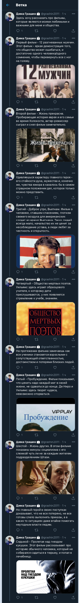

# Создание треда при помощи twitter api
---
## Как использовать:

* создать файл **text_to_post.txt**, где в каждой строчке указан текст твита. 
* загрузить изображения в папку **photos_to_post** с именами IMG_"номер".PNG, где "номер" соответвует порядковому номеру строки текстового файла - текста твита, то есть 1, 2, 3 и тд.

## Используемая логика:
Каждая строчка в файле разбивается на предложения, далее происходит разбивка этих предложений таким образом чтобы твиты умещались в 280 знаков.
Пример получившегося треда: 

